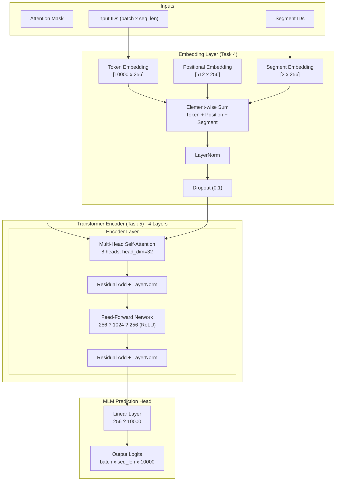

# Technical Architecture: Encoder-Only Transformer for Contextual Language Understanding

## 1. Overview

This document describes the architecture of an encoder-only transformer model trained from scratch using the Masked Language Modeling (MLM) objective on the SQuAD dataset. The model follows BERT-style pre?training and is designed for language understanding tasks such as question answering and text classification.

The implementation is structured into six main tasks:

- **Task 1:** Data preprocessing and text cleaning
- **Task 2:** Custom Byte Pair Encoding (BPE) tokenizer training
- **Task 3:** Masked Language Modeling (MLM) setup
- **Task 4:** Embedding layers (token, positional, segment)
- **Task 5:** Transformer encoder construction (from scratch)
- **Task 6:** Training loop and evaluation

---

## 2. High?Level Architecture

The following diagram illustrates the complete forward pass of the model, from tokenized input to MLM logits.



---

## 3. Data Preparation (Task 1)

**Input:** SQuAD dataset (training + validation splits)

**Processing steps:**
1. Load the dataset using Hugging Face `datasets` library.
2. Clean each context and question:
   - Unescape HTML entities
   - Remove HTML tags, URLs, email addresses
   - Normalize Unicode (NFKD) and convert to ASCII
   - Remove non-ASCII characters and excessive punctuation
   - Collapse multiple whitespaces
3. Split cleaned passages into sentences using NLTK `sent_tokenize`.
4. Discard very short sentences (length ? 2 words).
5. Append both sentence fragments and cleaned questions to the corpus.

**Output:** `squad_clean_corpus.txt` containing ~593,966 sentences.

---

## 4. Custom BPE Tokenizer (Task 2)

**Why domain-specific tokenizer?**
- Trained on the SQuAD corpus to capture QA-specific vocabulary.
- Reduces sequence length compared to generic tokenizers (e.g., GPT-2) by ~12–28%.
- Improves handling of domain terminology and reduces OOV tokens.

**Tokenizer configuration:**
- Algorithm: Byte Pair Encoding (BPE)
- Vocabulary size: 10,000
- Special tokens: `[UNK]`, `[CLS]`, `[SEP]`, `[PAD]`, `[MASK]`
- Pre?tokenization: Whitespace splitting
- Post?processor: Adds `[CLS]` at the beginning and `[SEP]` at the end.

**Output:** `squad_bpe_tokenizer.json`

---

## 5. Masked Language Modeling Setup (Task 3)

The `MLMProcessor` class generates training samples following BERT's masking strategy:

- **Masking probability:** 15% of tokens (excluding special tokens)
- **Token replacement:**
  - 80% ? `[MASK]` token
  - 10% ? random token from vocabulary
  - 10% ? unchanged (original token)
- **Labels:** Only masked positions have the original token ID; others are set to `-100` (ignored by CrossEntropyLoss).

**Method:** `create_mlm_training_sample(text, max_length)` returns a dictionary with `input_ids`, `labels`, `attention_mask`.

---

## 6. Embedding Layers (Task 4)

Three independent embedding components are implemented as PyTorch modules:

| Component | Description | Shape |
|-----------|-------------|-------|
| TokenEmbedding | Learnable lookup table | `[10000, 256]` |
| PositionalEmbedding | Learnable absolute position embeddings | `[512, 256]` |
| SegmentEmbedding | Distinguishes sentence A vs B | `[2, 256]` |

`BERTEmbedding` combines these by element-wise summation, followed by LayerNorm and Dropout.

**Hyperparameters:**
- `embedding_dim = 256`
- `max_seq_length = 512`
- `num_segments = 2`
- `dropout_rate = 0.1`
- `padding_idx = 3` (index of `[PAD]` token)

---

## 7. Transformer Encoder (Task 5)

The encoder is built from scratch using the following components:

### 7.1 Multi?Head Self?Attention (MHSA)
- `num_heads = 8`, head dimension = `256 / 8 = 32`
- Separate linear projections for Q, K, V (`embedding_dim ? embedding_dim` each)
- Output projection: `embedding_dim ? embedding_dim`
- Scaled dot?product attention: `softmax(QK^T / sqrt(head_dim)) · V`
- Attention mask support for padding tokens
- Attention dropout: 0.1

### 7.2 Position?wise Feed?Forward Network (FFN)
- Two linear layers: `256 ? 1024 ? 256`
- ReLU activation between layers
- Dropout: 0.1

### 7.3 Transformer Encoder Layer
Post?LayerNorm architecture (original Transformer style):

```
x = LayerNorm(x + Dropout(MHSA(x, x, x, mask)))
x = LayerNorm(x + Dropout(FFN(x)))
```

### 7.4 Encoder Stack
- Number of layers: `num_layers = 4`
- Each layer has identical hyperparameters but independent weights.

### 7.5 MLM Prediction Head
- Single linear layer: `256 ? 10,000` (embedding_dim ? vocab_size)

**Total trainable parameters:** 8,421,136

### 7.6 Parameter Breakdown

| Component | Parameters |
|-----------|-----------|
| Token Embedding (`10000 × 256`) | 2,560,000 |
| Positional Embedding (`512 × 256`) | 131,072 |
| Segment Embedding (`2 × 256`) | 512 |
| Embedding LayerNorm | 512 |
| 4× Encoder Layers (MHSA + FFN + LayerNorms) | ~3,160,064 |
| MLM Head (`256 ? 10000`) | ~2,570,000 |
| **Total** | **~8,421,136** |

---

## 8. Training & Evaluation (Task 6)

### 8.1 Dataset Split
- Full cleaned corpus: ~593,966 sentences
- Train/validation split: 90/10 ? **534,569** train, **59,397** validation

### 8.2 DataLoader
- `batch_size = 32`
- `max_length = 128` (truncation/padding)
- Random shuffling for training

### 8.3 Training Configuration
- **Environment:** BITS Pilani WILP Kubeflow Remote Lab
- **Optimizer:** AdamW (`lr=5e-4`, `weight_decay=0.01`)
- **Scheduler:** LinearLR with warmup over first 2 epochs (`start_factor=0.1`)
- **Loss function:** CrossEntropyLoss (ignoring `-100` labels)
- **Gradient clipping:** max norm = 1.0
- **Epochs:** 50 max (with early stopping)

### 8.4 Evaluation Metrics
- **Validation loss** (cross?entropy on masked tokens)
- **Masked token accuracy** (percentage of correctly predicted masked positions)

### 8.5 Early Stopping
Training stops if validation loss does not improve for 5 consecutive epochs after epoch 10.

---

## 9. Results

- **Final validation accuracy:** **45.70%** (at epoch 48)
- **Best validation loss:** **3.08** (down from initial ~7.0)
- **Training dataset:** 534,569 sentences (90% of cleaned corpus)
- **Validation dataset:** 59,397 sentences (10%)

**Interpretation:** Random chance on a 10,000?class vocabulary is 0.01%. The model's 45.7% accuracy is **4,570× better than random**, demonstrating strong subword?level contextual learning.

**Sample correct predictions (from validation set):**

| # | Masked Sentence (abbreviated) | Masked Token | Predicted Token |
|---|-------------------------------|--------------|------------------|
| 1 | Thus, the stage was set for the [MASK] of an approach to philosophy … | adoption | adoption |
| 2 | Many different types of interaction can be [MASK] by how buttons | many | many |
| 3 | … the Prosecutor has found reasonable grounds to [MASK] that the identified … | his | his |
| 4 | [MASK] war arose from the division of Korea at the end of World War II … | The | The |
| 5 | What is the closest international airport to Saint [MASK] called? | Helena | Helena |

---

## 10. Summary of Architectural Decisions

| Component | Choice | Rationale |
|-----------|--------|-----------|
| Tokenizer | BPE (vocab=10k) | Domain adaptation, shorter sequences |
| Embedding dim | 256 | Balance between capacity and speed |
| Encoder layers | 4 | Sufficient for MLM; avoids overfitting |
| Attention heads | 8 | Standard for dim=256 (head_dim=32) |
| FFN hidden dim | 1024 | 4× embedding dimension (common practice) |
| Max sequence length | 128 (training) | Covers most SQuAD sentences, reduces memory |
| Dropout | 0.1 | Regularisation across all layers |
| Optimizer | AdamW | Better weight decay handling |
| Learning rate | 5e-4 | Empirical optimum for this model size |
| Warmup | 2 epochs (start_factor=0.1) | Stabilises early training |

---

## 11. Conclusion

The implemented encoder?only transformer successfully learns contextual representations via MLM, achieving **45.7% masked token prediction accuracy** on the SQuAD validation set – far above random chance (0.01%). The architecture follows BERT-style design with a custom BPE tokenizer, embedding layers, multi?head self?attention, and position?wise FFNs. The model can be fine?tuned for downstream tasks like extractive QA or classification.

---
**Technical Architecture Document Generated from:** `Group12_ConversationAI_SPK_PS1.ipynb`
